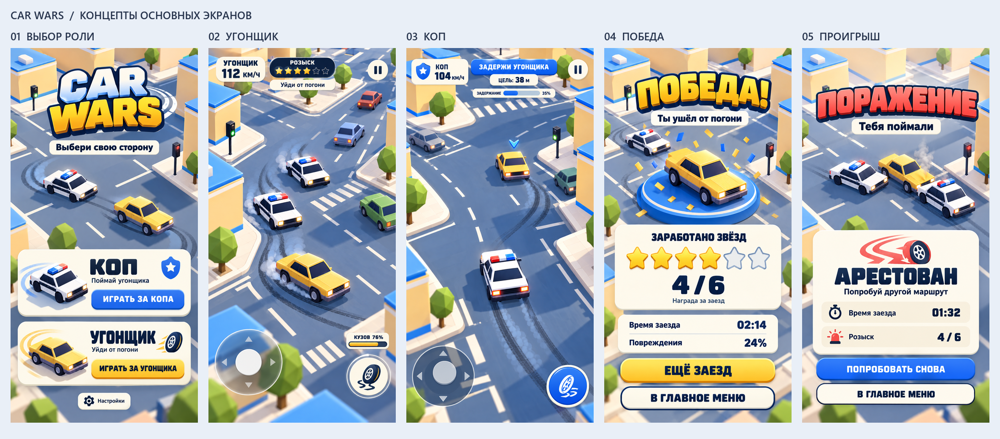

# CarWars — концепты основных экранов

Дата: 2026-10-08. Пять связанных концептов созданы встроенным ImageGen по запросу пользователя. Это визуальное предложение будущих экранов; режим копа, выбор стороны, правила победы и система наград этим набором не реализованы.



| Экран | Полный PNG | Содержание |
| --- | --- | --- |
| Старт | [Выбор роли](01-role-selection.png) | Равноправные карточки «Коп» и «Угонщик», отдельные кнопки запуска. |
| Геймплей | [Угонщик](02-gameplay-thief.png) | Жёлтый автомобиль, преследующая полиция, скорость, шесть звёзд розыска, состояние кузова. |
| Геймплей | [Коп](03-gameplay-cop.png) | Полицейская машина, отмеченная цель, расстояние и прогресс задержания. |
| Победа | [Награда](04-victory.png) | Количество заработанных звёзд, время, повреждения, повтор и меню. |
| Проигрыш | [Арест](05-defeat.png) | Причина поражения, статистика, повтор и меню. |

## Визуальное решение

Сохранена основа [текущей арт-дирекции](../../ART-DIRECTION.md): солнечный город-миниатюра, крупные простые здания без окон, синие кровли, матовые машины, тёплый свет и прохладное заполнение. Интерфейс: кремовые скруглённые карточки, тёмно-синий текст; синий — коп, золотой — угонщик и награда, коралловый — поражение. Простые деревья и дополнительные скругления — детали предложенного концепта.

Основной референс — собственный игровой кадр [390×844](../../verification/after/390x844-high.png). Первый концепт использован как общий референс для остальных четырёх. Исходные PNG сохранены без перерисовки, кадрирования или сжатия; фактический размер каждого — **887×1774**, RGB, пропорция **1:2**. Это размер генерации, а не обещанный размер игрового viewport.

## Предположения для концепта

- Вертикальный мобильный формат выбран по текущим основным viewport игры. Горизонтальные экраны здесь не разработаны.
- Победа и проигрыш показаны на примере угонщика. Для копа сохраняется структура результата, но требуются другой автомобиль и тексты «Угонщик задержан» / «Угонщик скрылся».
- Четыре наградные звезды из шести — иллюстративный результат. Подпись «Заработано звёзд» отличает награду от шести звёзд розыска в игровом HUD; алгоритм начисления пользователь не задавал.
- Время, скорость, расстояние, прогресс и повреждения — примеры компоновки.
- Кнопки ручника и показ прогресса за копа — предложения интерфейса. Они не подтверждают наличие этих элементов в текущей мобильной игре.
- Генерированный логотип и типографика служат визуальным ориентиром; при реализации текст и интерфейс должны быть отдельными DOM/SVG-элементами.

## Проверка и происхождение

Все пять PNG декодируются, имеют одинаковые размеры, непрозрачный фон и не обрезают основные кнопки. Визуально проверены единая палитра, роли автомобилей, кириллица, шесть звёзд розыска и четыре заполненные наградные звезды. Обзорный лист просмотрен с каждым экраном в ширине 390 px: названия, основные кнопки, машины и результат читаются; мелкие показатели игрового HUD при реализации потребуют отдельной проверки DOM на 360×740 и 390×844. Запуск в движке для концепт-артов не выполнялся.

[Манифест](manifest.json) содержит назначения, ограничения и происхождение; [промпты](prompts.json) — полный набор использованных запросов встроенного ImageGen; [технический отчёт](verification.json) — размеры и декодирование. Версия модели инструментом не раскрывается. Сторонняя лицензия generated PNG не приписывается. Изображения не являются импортированными runtime-ассетами.

Обзорный лист собирается без изменения содержимого концептов:

```powershell
python docs/art/concepts/2026-10-08/build-overview.py
```

Проверка PNG выполнена скриптом установленного навыка:

```powershell
$conceptFiles = Get-ChildItem -LiteralPath 'docs/art/concepts/2026-10-08' -Filter '0*.png' | Select-Object -ExpandProperty FullName
python .agents/skills/create-game-assets/scripts/asset_report.py @conceptFiles --expect-size 887x1774 --json
```

Код игры не менялся; сборка и тесты игрового поведения для этого набора изображений не требуются.
