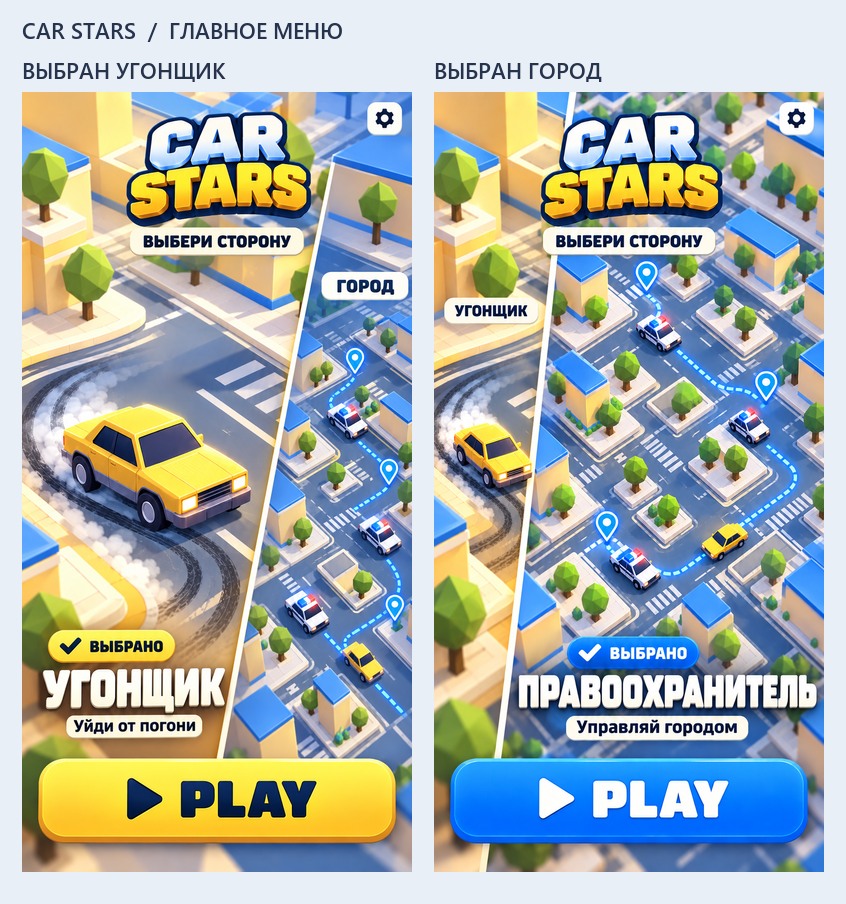

# CAR STARS — главное меню v2

Дата: 2026-10-08. Новое название игры — **Car Stars**. Главное меню переработано по уточнению пользователя: выбор между угонщиком и правоохранителем, который играет за город.



- [Выбран угонщик](01-thief-selected.png): левая золотая сторона раскрывается; герой — одна жёлтая машина.
- [Выбран правоохранитель](02-city-selected.png): правая синяя сторона раскрывается; герой — городской район с несколькими патрулями и координацией их маршрутов.
- Одна большая кнопка **PLAY** запускает выбранную сторону.
- Логотип, настройки и кнопка PLAY занимают одинаковые места в обоих концептах.

## Поведение при реализации

Экран разделён на две соседние области: угонщик слева, город справа. Касание любой области выбирает роль и раскрывает её примерно до 70% ширины; вторая сжимается примерно до 30%. Соотношение 70/30 и небольшая диагональ разделителя — решение для концепта; пользователь задал только преобладание выбранной стороны.

Выбор роли не запускает игру. Запуск происходит отдельным нажатием PLAY. Цвет общей кнопки и отметка «Выбрано» показывают активную роль. Тексты роли: «Угонщик — Уйди от погони» и «Правоохранитель — Управляй городом». Длинное название правоохранителя в адаптивном UI должно сохранять отступы и при необходимости переноситься, а не уменьшаться до нечитаемого размера.

Городская карта с тремя патрулями, маркерами и маршрутами объясняет масштаб роли. Это художественное предложение; конкретные команды и механика управления городом этим запросом не определены. Старый концепт геймплея за одну полицейскую машину больше не отражает уточнённую роль.

## Файлы и проверка

Два итоговых PNG созданы встроенным ImageGen; исходные файлы скопированы без изменения содержания. Формат RGB PNG, фактический размер 887×1774, пропорция 1:2. Они концепт-арты, не runtime-ассеты. Стартовое меню и городской режим не реализованы в игровом коде.

Визуально проверены новое название, разделённая композиция, преобладание выбранной стороны, одна кнопка PLAY, кириллица, три патруля на выбранной городской стороне. Обзорный лист показывает каждый экран в ширине 390 px. Читаемость реального DOM-интерфейса потребует проверки после реализации.

[Промпты](prompts.json) содержат исходные запросы и уточнение городской версии; [манифест](manifest.json) фиксирует происхождение и ограничения; [техническая проверка](verification.json) фиксирует декодирование и размеры. Промежуточный вариант городской версии отклонён из-за другого расположения интерфейса; окончательная версия использует выбранного угонщика как референс компоновки. Версия модели инструментом не раскрывается; сторонняя лицензия не приписывается.

В текущем приложении обновлено видимое название вкладки (`index.html`) и заголовок корневого README. Проверка сборки записана в отчёте `verification.json`. Предыдущие концепты сохранены как история.

Для пересборки обзора:

```powershell
python docs/art/concepts/2026-10-08/car-stars-menu-v2/build-overview.py
```
